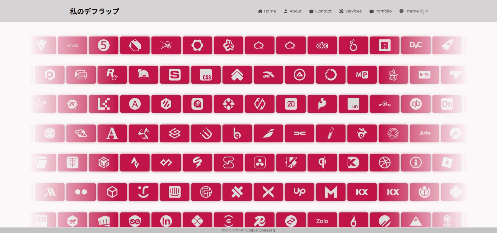
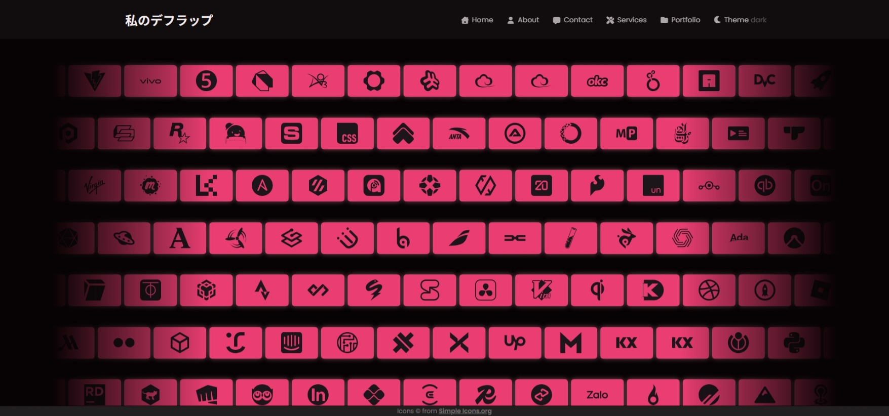
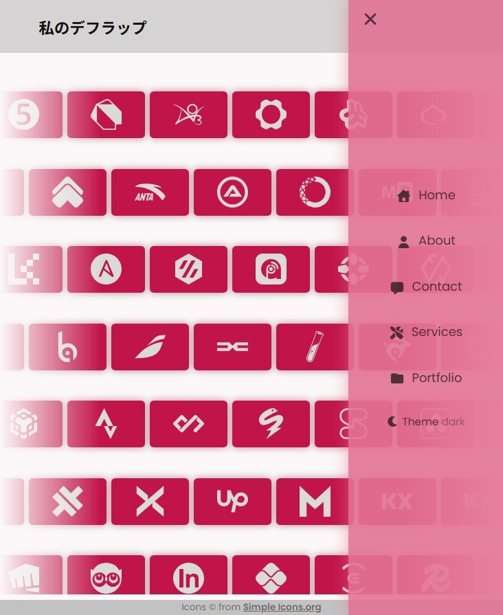
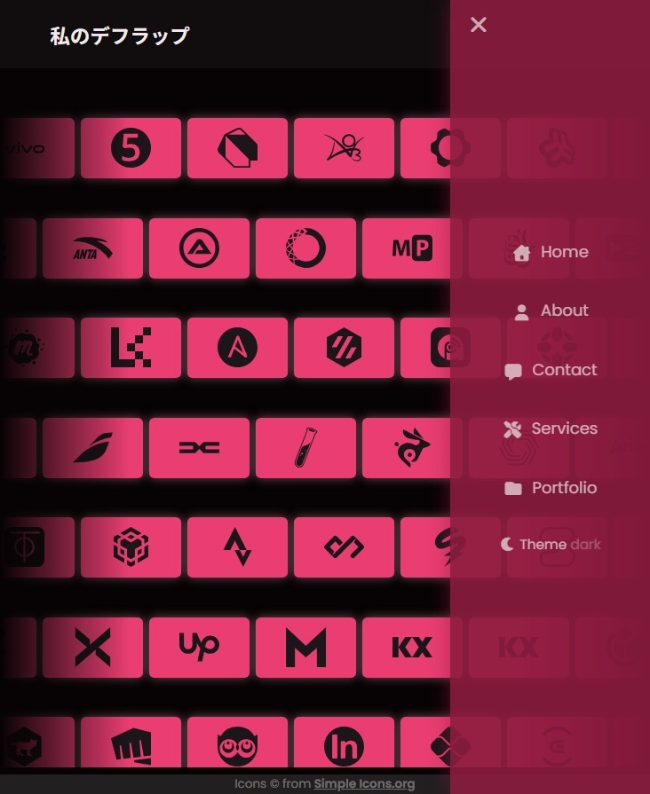

# 私のデフラップ (My Dev Lap) - Infinite Scroll Animation

[](https://developer.mozilla.org/en-US/docs/Web/Guide/HTML/HTML5)
[](https://developer.mozilla.org/en-US/docs/Web/CSS)
[](https://developer.mozilla.org/en-US/docs/Web/JavaScript)

This project is a single-page demonstration of an infinite scrolling icon animation, built primarily with **Pure CSS Animation**. It features a persistent Dark/Light Mode toggle (using `localStorage`) and a responsive mobile-ready navbar.

🔗 **Live Demo:** `https://your-demo-url-here.netlify.app/`

> _not deploy yet_

## 🖼️ Preview

**Light Mode (Desktop)**



**Dark Mode (Desktop)**



---

|                         **Mobile Light Mode**                          |                         **Mobile Dark Mode**                         |
| :--------------------------------------------------------------------: | :------------------------------------------------------------------: |
|  |  |

## ✨ Features

- **Pure CSS Infinite Scroll:** A smooth, looping animation created entirely with CSS Keyframes.
- **Alternating Directions:** Rows animate in alternating directions (left-to-right and right-to-left) for a dynamic effect.
- **Persistent Dark/Light Theme:** A theme-switcher that saves the user's preference in `localStorage`.
- **Responsive Navbar:** The navigation bar adapts seamlessly into a hamburger side-menu on smaller screens.
- **Click Outside to Close:** On mobile, the side-menu can be closed by clicking on the blurred overlay area.
- **Accessibility:** Respects user preferences by disabling all animations if `prefers-reduced-motion` is enabled.

---

## 🛠️ Technical Breakdown: The Heart of the Infinite Scroll

Many might assume this animation requires complex JavaScript, but it's actually just clever CSS Animation and a bit of math.

### 1. The Core Animation

We use two `@keyframes`: `slideLeft` and `slideRight`.

- `slideLeft` moves a row from `left: 100%` (off-screen right) to `left: -100px` (off-screen left).
- `slideRight` does the opposite, moving from `right: 100%` to `right: -100px`.

```css
@keyframes slideLeft {
  from {
    left: max(calc(100px * 15), 100%);
  }
  to {
    left: -100px; /* Width of one card */
  }
}

@keyframes slideRight {
  from {
    right: max(calc(100px * 15), 100%);
  }
  to {
    right: -100px; /* Width of one card */
  }
}
```

### 2. The Magic Trick: Achieving a Seamless Loop (Staggered Delay)

If all icons started their animation at the same time, they would move as one giant block.
The trick is to use a negative `animation-delay`.
Instead of starting all icons at `0s`, we "fast-forward" each icon's animation to a different starting point on its path using this formula:

```css
/* DURATION = 25s (total time for one loop)
 * TOTAL_ITEMS = 15 (number of items in the row)
 * ITEM_NUMBER = (15 - N) (where N is the item's index)
*/

.item1 {
  animation-delay: calc(25s / 15 * (15 - 1) * -1);
  /* Result: -23.33s */
}
.item2 {
  animation-delay: calc(25s / 15 * (15 - 2) * -1);
  /* Result: -21.66s */
}
/* ...and so on to .item15 */
.item15 {
  animation-delay: calc(25s / 15 * (15 - 15) * -1);
  /* Result: 0s */
}
```

This negative delay makes each icon start at a different, staggered position in the animation cycle. The result is a fully populated, continuous loop that appears to be running from the moment the page loads.

### 3. Fading Edges

To make the icons appear and disappear smoothly at the edges, we apply a `mask-image` to the `.container`.

```css
.container {
  mask-image: linear-gradient(
    to right,
    rgba(0, 0, 0, 0),     /* Fade out on the left */
    rgba(0, 0, 0, 1) 20%,  /* Fully visible */
    rgba(0, 0, 0, 1) 80%,  /* Fully visible */
    rgba(0, 0, 0, 0)      /* Fade out on the right */
  );
}
```

### 4. Theme Switching Logic

- Uses CSS Variables (Custom Properties) defined in `:root[data-theme="light"]` and `:root[data-theme="dark"]`.
- JavaScript `(script.js)` simply toggles the `data-theme` attribute on the `<html>` element.
- The preference is saved to `localStorage` to persist across sessions.

---

## 🚀 How to Run Locally

1. Clone a copy of this repository.
2. Open the `index.html` file in your web browser.
3. That's it!

---

### 📜 Credits

All SVG icons are from Simple [**Icons.org.**](https://simpleicons.org/)

